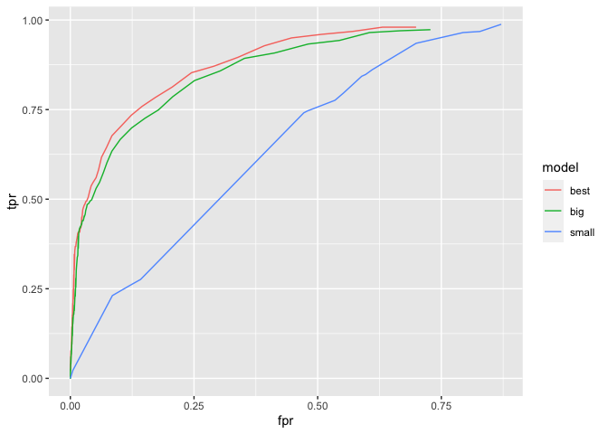
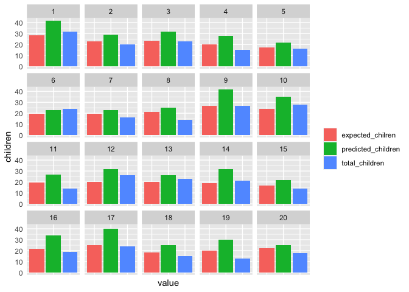

# Problem 1

 The above
figure shows average hourly boardings for UT Cap Metro rides over a
three month period, faceted by day of the week. Daily trends look
similar accross all weekdays, with a peak around 4-5 PM. However,
weekend boardings are much lower than weekdays and do not have a sharp
peak. Boardings on Mondays in September look lower compared to other
days and months because Labor Day is a day off from school, so there is
one less Monday in September where students are on campus. Similarly,
boardings on Weds/Thurs/Fri in November look lower likely due to the
Thanksgiving holiday.
 In the
above figure, each facet plots UT CapMetro boardings by temperature on
weekdays and weekends. Holding hour of day and weekend status constant,
temperature does NOT seem to have a noticeable effect on the number of
UT students riding the bus. This is seen by the relatively flat trends
across all hours. A very slight upward trend might be present in the
early morning hours as well as the late night hours, but it is very
slight and likely insignificant. Demand for the bus on UT does not
appear to respond to changes in temperature. # Problem 2

<table>
<caption>Model Fit Comparison</caption>
<thead>
<tr class="header">
<th style="text-align: left;">model</th>
<th style="text-align: right;">rmse</th>
<th style="text-align: right;">k_optimal</th>
</tr>
</thead>
<tbody>
<tr class="odd">
<td style="text-align: left;">lmmedium</td>
<td style="text-align: right;">66448.63</td>
<td style="text-align: right;">0</td>
</tr>
<tr class="even">
<td style="text-align: left;">lmstep</td>
<td style="text-align: right;">65428.21</td>
<td style="text-align: right;">0</td>
</tr>
<tr class="odd">
<td style="text-align: left;">knn</td>
<td style="text-align: right;">61956.98</td>
<td style="text-align: right;">10</td>
</tr>
</tbody>
</table>

Model Fit Comparison

# Problem 3

    ##    yhat
    ## y     0   1
    ##   0 128  10
    ##   1  46  16

# Problem 4

<table>
<caption>Out-of-Sample Performance</caption>
<thead>
<tr class="header">
<th style="text-align: left;">model</th>
<th style="text-align: right;">true_pos</th>
<th style="text-align: right;">true_neg</th>
<th style="text-align: right;">false_pos</th>
<th style="text-align: right;">false_neg</th>
<th style="text-align: right;">tpr</th>
<th style="text-align: right;">fpr</th>
<th style="text-align: right;">fdr</th>
</tr>
</thead>
<tbody>
<tr class="odd">
<td style="text-align: left;">best</td>
<td style="text-align: right;">1987</td>
<td style="text-align: right;">39728</td>
<td style="text-align: right;">1637</td>
<td style="text-align: right;">1648</td>
<td style="text-align: right;">0.547</td>
<td style="text-align: right;">0.040</td>
<td style="text-align: right;">0.452</td>
</tr>
<tr class="even">
<td style="text-align: left;">big</td>
<td style="text-align: right;">1805</td>
<td style="text-align: right;">39542</td>
<td style="text-align: right;">1823</td>
<td style="text-align: right;">1830</td>
<td style="text-align: right;">0.497</td>
<td style="text-align: right;">0.044</td>
<td style="text-align: right;">0.502</td>
</tr>
<tr class="odd">
<td style="text-align: left;">small</td>
<td style="text-align: right;">1</td>
<td style="text-align: right;">41358</td>
<td style="text-align: right;">7</td>
<td style="text-align: right;">3634</td>
<td style="text-align: right;">0.000</td>
<td style="text-align: right;">0.000</td>
<td style="text-align: right;">0.875</td>
</tr>
</tbody>
</table>

Out-of-Sample Performance

<table>
<caption>Model Validation</caption>
<colgroup>
<col style="width: 8%" />
<col style="width: 15%" />
<col style="width: 19%" />
<col style="width: 17%" />
<col style="width: 10%" />
<col style="width: 10%" />
<col style="width: 6%" />
<col style="width: 6%" />
<col style="width: 6%" />
</colgroup>
<thead>
<tr class="header">
<th style="text-align: right;">fold_id</th>
<th style="text-align: right;">total_children</th>
<th style="text-align: right;">predicted_children</th>
<th style="text-align: right;">expected_chilren</th>
<th style="text-align: right;">false_pos</th>
<th style="text-align: right;">false_neg</th>
<th style="text-align: right;">tpr</th>
<th style="text-align: right;">fpr</th>
<th style="text-align: right;">fdr</th>
</tr>
</thead>
<tbody>
<tr class="odd">
<td style="text-align: right;">1</td>
<td style="text-align: right;">32</td>
<td style="text-align: right;">42</td>
<td style="text-align: right;">28.72983</td>
<td style="text-align: right;">18</td>
<td style="text-align: right;">8</td>
<td style="text-align: right;">0.750</td>
<td style="text-align: right;">0.083</td>
<td style="text-align: right;">0.429</td>
</tr>
<tr class="even">
<td style="text-align: right;">2</td>
<td style="text-align: right;">20</td>
<td style="text-align: right;">29</td>
<td style="text-align: right;">22.97607</td>
<td style="text-align: right;">17</td>
<td style="text-align: right;">8</td>
<td style="text-align: right;">0.600</td>
<td style="text-align: right;">0.074</td>
<td style="text-align: right;">0.586</td>
</tr>
<tr class="odd">
<td style="text-align: right;">3</td>
<td style="text-align: right;">23</td>
<td style="text-align: right;">32</td>
<td style="text-align: right;">23.53076</td>
<td style="text-align: right;">17</td>
<td style="text-align: right;">8</td>
<td style="text-align: right;">0.652</td>
<td style="text-align: right;">0.075</td>
<td style="text-align: right;">0.531</td>
</tr>
<tr class="even">
<td style="text-align: right;">4</td>
<td style="text-align: right;">15</td>
<td style="text-align: right;">28</td>
<td style="text-align: right;">20.31590</td>
<td style="text-align: right;">17</td>
<td style="text-align: right;">4</td>
<td style="text-align: right;">0.733</td>
<td style="text-align: right;">0.072</td>
<td style="text-align: right;">0.607</td>
</tr>
<tr class="odd">
<td style="text-align: right;">5</td>
<td style="text-align: right;">16</td>
<td style="text-align: right;">22</td>
<td style="text-align: right;">17.19489</td>
<td style="text-align: right;">10</td>
<td style="text-align: right;">4</td>
<td style="text-align: right;">0.750</td>
<td style="text-align: right;">0.043</td>
<td style="text-align: right;">0.455</td>
</tr>
<tr class="even">
<td style="text-align: right;">6</td>
<td style="text-align: right;">24</td>
<td style="text-align: right;">23</td>
<td style="text-align: right;">19.78045</td>
<td style="text-align: right;">12</td>
<td style="text-align: right;">13</td>
<td style="text-align: right;">0.458</td>
<td style="text-align: right;">0.053</td>
<td style="text-align: right;">0.522</td>
</tr>
<tr class="odd">
<td style="text-align: right;">7</td>
<td style="text-align: right;">16</td>
<td style="text-align: right;">23</td>
<td style="text-align: right;">19.50105</td>
<td style="text-align: right;">13</td>
<td style="text-align: right;">6</td>
<td style="text-align: right;">0.625</td>
<td style="text-align: right;">0.056</td>
<td style="text-align: right;">0.565</td>
</tr>
<tr class="even">
<td style="text-align: right;">8</td>
<td style="text-align: right;">14</td>
<td style="text-align: right;">25</td>
<td style="text-align: right;">20.93070</td>
<td style="text-align: right;">15</td>
<td style="text-align: right;">4</td>
<td style="text-align: right;">0.714</td>
<td style="text-align: right;">0.064</td>
<td style="text-align: right;">0.600</td>
</tr>
<tr class="odd">
<td style="text-align: right;">9</td>
<td style="text-align: right;">27</td>
<td style="text-align: right;">42</td>
<td style="text-align: right;">26.96456</td>
<td style="text-align: right;">23</td>
<td style="text-align: right;">8</td>
<td style="text-align: right;">0.704</td>
<td style="text-align: right;">0.103</td>
<td style="text-align: right;">0.548</td>
</tr>
<tr class="even">
<td style="text-align: right;">10</td>
<td style="text-align: right;">28</td>
<td style="text-align: right;">35</td>
<td style="text-align: right;">23.96460</td>
<td style="text-align: right;">17</td>
<td style="text-align: right;">10</td>
<td style="text-align: right;">0.643</td>
<td style="text-align: right;">0.077</td>
<td style="text-align: right;">0.486</td>
</tr>
<tr class="odd">
<td style="text-align: right;">11</td>
<td style="text-align: right;">14</td>
<td style="text-align: right;">27</td>
<td style="text-align: right;">19.42546</td>
<td style="text-align: right;">20</td>
<td style="text-align: right;">7</td>
<td style="text-align: right;">0.500</td>
<td style="text-align: right;">0.085</td>
<td style="text-align: right;">0.741</td>
</tr>
<tr class="even">
<td style="text-align: right;">12</td>
<td style="text-align: right;">26</td>
<td style="text-align: right;">32</td>
<td style="text-align: right;">20.24675</td>
<td style="text-align: right;">15</td>
<td style="text-align: right;">9</td>
<td style="text-align: right;">0.654</td>
<td style="text-align: right;">0.067</td>
<td style="text-align: right;">0.469</td>
</tr>
<tr class="odd">
<td style="text-align: right;">13</td>
<td style="text-align: right;">23</td>
<td style="text-align: right;">26</td>
<td style="text-align: right;">19.81964</td>
<td style="text-align: right;">11</td>
<td style="text-align: right;">8</td>
<td style="text-align: right;">0.652</td>
<td style="text-align: right;">0.048</td>
<td style="text-align: right;">0.423</td>
</tr>
<tr class="even">
<td style="text-align: right;">14</td>
<td style="text-align: right;">21</td>
<td style="text-align: right;">32</td>
<td style="text-align: right;">19.18783</td>
<td style="text-align: right;">21</td>
<td style="text-align: right;">10</td>
<td style="text-align: right;">0.524</td>
<td style="text-align: right;">0.092</td>
<td style="text-align: right;">0.656</td>
</tr>
<tr class="odd">
<td style="text-align: right;">15</td>
<td style="text-align: right;">14</td>
<td style="text-align: right;">22</td>
<td style="text-align: right;">16.47530</td>
<td style="text-align: right;">14</td>
<td style="text-align: right;">6</td>
<td style="text-align: right;">0.571</td>
<td style="text-align: right;">0.059</td>
<td style="text-align: right;">0.636</td>
</tr>
<tr class="even">
<td style="text-align: right;">16</td>
<td style="text-align: right;">19</td>
<td style="text-align: right;">34</td>
<td style="text-align: right;">21.55083</td>
<td style="text-align: right;">19</td>
<td style="text-align: right;">4</td>
<td style="text-align: right;">0.789</td>
<td style="text-align: right;">0.082</td>
<td style="text-align: right;">0.559</td>
</tr>
<tr class="odd">
<td style="text-align: right;">17</td>
<td style="text-align: right;">24</td>
<td style="text-align: right;">40</td>
<td style="text-align: right;">24.78111</td>
<td style="text-align: right;">25</td>
<td style="text-align: right;">9</td>
<td style="text-align: right;">0.625</td>
<td style="text-align: right;">0.111</td>
<td style="text-align: right;">0.625</td>
</tr>
<tr class="even">
<td style="text-align: right;">18</td>
<td style="text-align: right;">15</td>
<td style="text-align: right;">25</td>
<td style="text-align: right;">18.23337</td>
<td style="text-align: right;">17</td>
<td style="text-align: right;">7</td>
<td style="text-align: right;">0.533</td>
<td style="text-align: right;">0.072</td>
<td style="text-align: right;">0.680</td>
</tr>
<tr class="odd">
<td style="text-align: right;">19</td>
<td style="text-align: right;">13</td>
<td style="text-align: right;">30</td>
<td style="text-align: right;">19.94223</td>
<td style="text-align: right;">21</td>
<td style="text-align: right;">4</td>
<td style="text-align: right;">0.692</td>
<td style="text-align: right;">0.089</td>
<td style="text-align: right;">0.700</td>
</tr>
<tr class="even">
<td style="text-align: right;">20</td>
<td style="text-align: right;">18</td>
<td style="text-align: right;">25</td>
<td style="text-align: right;">22.06781</td>
<td style="text-align: right;">13</td>
<td style="text-align: right;">6</td>
<td style="text-align: right;">0.667</td>
<td style="text-align: right;">0.056</td>
<td style="text-align: right;">0.520</td>
</tr>
</tbody>
</table>

Model Validation
