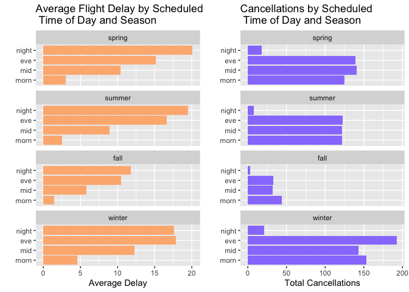
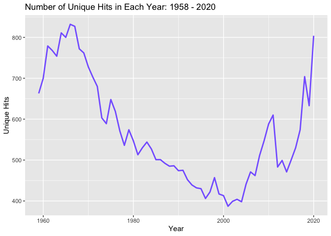
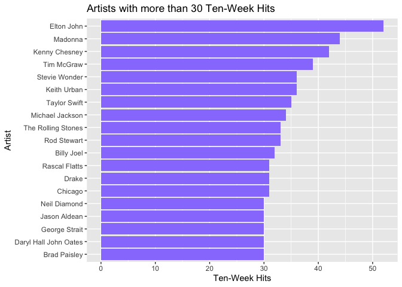
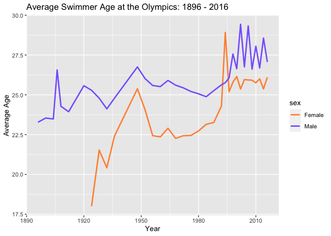
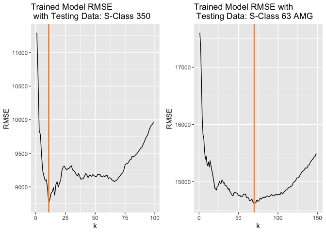
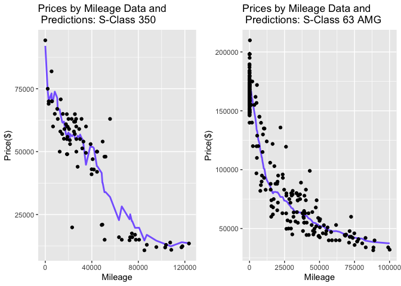

## Exercise 1

The above bar panels show how flight delays and cancellations of Austin
Airport (AUS) flights change by time of day as well as by season. A few
trends can be identified from this figure. First, flight delays appear
to increase as the day goes on, while cancellations appear to be more
prevalent in the mornings and less in the evenings. Winter seems to have
more cancellations and longer delays across all times while Fall seems
to have less. The best time to fly depends on whether someone wants to
avoid a flight delay or a cancellation. Fall mornings have the shortest
delays while Fall night flights are least likily to get canceled.

## Exercise 2

### Part A

<table>
<caption>Top 10 Songs: 1958 - 2021</caption>
<thead>
<tr class="header">
<th style="text-align: left;">song</th>
<th style="text-align: left;">performer</th>
<th style="text-align: right;">count</th>
</tr>
</thead>
<tbody>
<tr class="odd">
<td style="text-align: left;">Radioactive</td>
<td style="text-align: left;">Imagine Dragons</td>
<td style="text-align: right;">87</td>
</tr>
<tr class="even">
<td style="text-align: left;">Sail</td>
<td style="text-align: left;">AWOLNATION</td>
<td style="text-align: right;">79</td>
</tr>
<tr class="odd">
<td style="text-align: left;">Blinding Lights</td>
<td style="text-align: left;">The Weeknd</td>
<td style="text-align: right;">76</td>
</tr>
<tr class="even">
<td style="text-align: left;">I’m Yours</td>
<td style="text-align: left;">Jason Mraz</td>
<td style="text-align: right;">76</td>
</tr>
<tr class="odd">
<td style="text-align: left;">How Do I Live</td>
<td style="text-align: left;">LeAnn Rimes</td>
<td style="text-align: right;">69</td>
</tr>
<tr class="even">
<td style="text-align: left;">Counting Stars</td>
<td style="text-align: left;">OneRepublic</td>
<td style="text-align: right;">68</td>
</tr>
<tr class="odd">
<td style="text-align: left;">Party Rock Anthem</td>
<td style="text-align: left;">LMFAO Featuring Lauren Bennett &amp; GoonRock</td>
<td style="text-align: right;">68</td>
</tr>
<tr class="even">
<td style="text-align: left;">Foolish Games/You Were Meant For Me</td>
<td style="text-align: left;">Jewel</td>
<td style="text-align: right;">65</td>
</tr>
<tr class="odd">
<td style="text-align: left;">Rolling In The Deep</td>
<td style="text-align: left;">Adele</td>
<td style="text-align: right;">65</td>
</tr>
<tr class="even">
<td style="text-align: left;">Before He Cheats</td>
<td style="text-align: left;">Carrie Underwood</td>
<td style="text-align: right;">64</td>
</tr>
</tbody>
</table>

Top 10 Songs: 1958 - 2021

The above table show the 10 songs with the most weeks spent on the
Billboard Hot 100 song list.

### Part B

This is a time plot of the number of unique songs to make the Billboard
Hot 100 between the years 1959-2020. It is interesting to see the number
of unique songs decline from it’s peak in the 1960s, reach bottom in the
early 2000s, and start to climb again through 2020.

### Part C

These are the 19 artists who had more than 30 songs which stayed on the
Hot 100 for at least 10 consecutive weeks between 1958 and mid-2021.

## Exercise 3

### Part A

The 95th percentile of heights for female competitors across all
Athletics events is Volleyball with an average height of 179.522 cm.

### Part B

Rowing Women’s Coxed Fours is the single women’s event had the greatest
variability in competitor’s heights across the entire history of the
Olympics, with a standard deviation of 10.865 cm.

### Part C

The above time plot shows how the average age of male and female
swimmers at the olympics has increased over time. The male swimmer ages
trend steadily upward from early 20s in the 1890s to mid-late 20s in the
2010s. Female ages, on the other hand, trend sharply upward between the
1920s and the late 1940s, level off in the mid 1900s, and climb again
toward the turn of the century.

## Exercise 4

The above 4 panels show the results of a k-nearest-neighbors (KNN) model
trained to predict prices of two models of Mercedes S-Class automobiles
based on their mileage. The two models, 350 and 63 AMG, are treated
separately. The data for each model receives an 80/20 train/test split.
Several different k values are used to train the KNN and determine the k
that results in the lowest RMSE when plotted against the testing data..
For a particular train/test split (shown above), the k value that
results in the lowest rmse for the 350 model is k = 11 and k = 70 for
the 63 AMG.

Across most train/test splits, the optimal k for the 63 AMG model is
larger than the optimal k for the 350 model. This is because the 350
model dataset only has 416 observations while the 63 AMG model has 1413
observations. This means that for a given point in the 350 model data,
the k nearest neighbors are likely spread out over a wide mileage range,
making bias a problem even at relatively small values of k. On the other
hand, the k nearest neighbors for a point in the 63 AMG data are likely
to be close by in mileage, so the KNN can get away with a larger k,
making the model smoother before bias becomes a problem.
